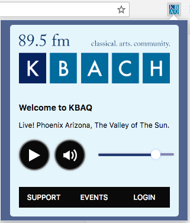

# KBAQ Chrome Extension
> ###### *Play Wonderful 89.5 KBAQ Classical Music right from your Google Chrome browser!*

### What is KBAQ?
> ######  "K Bach" is a Phoenix metro area FM radio station that plays classical music twenty-four hours per day. The broadcast schedule consists primarily of playlists announced by local hosts, as well as a few nationally syndicated broadcasts from NPR and American Public Media.

### Links
* [KBAQ.org](https://kbaq.org/)
* [Wiki Article on KBAQ](https://en.wikipedia.org/wiki/KBAQ)

## Installation

### Google Chrome Store
 1. Download and Install it on the Google Chrome Store [Here](https://chrome.google.com/webstore/detail/unofficial-895-fm-kbaq-pl/ckbmhabdbjkjcboaalpejnemefkjlpin)

### Manual

 1. [Download Zipped File](https://github.com/rloniello/KBAQ-Chrome-Extension/archive/master.zip)
 2. Unzip File
 3. Open Chrome Browser
 4. In URL goto **chrome://extensions/**
 5. Turn "Developer Mode" on
 6. Click **Load Unpacked** and select the Unzipped Folder from **step 2**.
